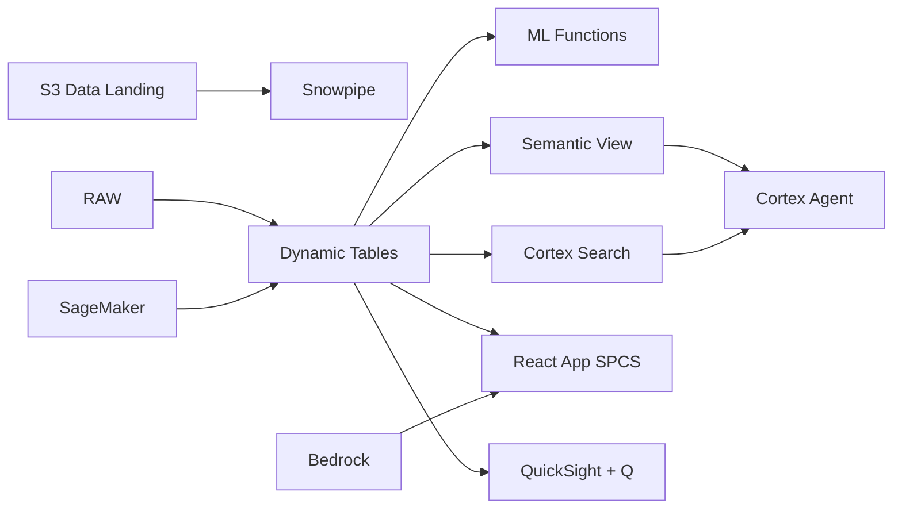

# Electronics Supply Chain Visibility

Multi-tier supplier tracking for Vietnam's US$114B electronics export sector — Dynamic Tables build real-time supply graphs, ML.FORECAST predicts lead times, and Iceberg enables Samsung/Apple supply chain audits via Athena.

## Architecture

Vietnam has become Samsung's largest global production base and a key Apple supplier, exporting USB in electronics in 2023. Managing 200 suppliers across 4 countries to meet 98-99% OEM delivery SLAs requires real-time supply chain visibility — not monthly spreadsheet reviews.



## Snowflake Capabilities

| Capability | Implementation |
|-----------|---------------|
| Dynamic Tables | SUPPLIER_RISK_SCORE / DELIVERY_COMPLIANCE / LEAD_TIME_ANALYTICS / SUPPLY_GRAPH |
| ML Functions | ML.FORECAST + ML.ANOMALY_DETECTION |
| Cortex AI | COMPLETE, AI_CLASSIFY, SUMMARIZE |
| Cortex Search | 80 documents indexed |
| Cortex Agent | SUPPLY_CHAIN_AGENT |
| Semantic View | SUPPLY_CHAIN_ANALYTICS |
| React App (SPCS) | 5 tabs + DemoGuide |


## AWS Services

| Service | Role in Demo |
|---------|-------------|
| Amazon S3 | Store supplier documents and quality inspection data |
| AWS Glue | ETL for BOM and supplier data integration |
| Apache Iceberg (on S3) | Open table format for OEM customer supply chain audits |
| Amazon SageMaker | Lead time prediction and disruption detection models |
| Amazon Bedrock (Claude) | Generate supplier risk assessments |
| Amazon QuickSight + Q | Supply chain dashboard with natural language |


## Personas

| Persona | Role | Key Questions |
|---------|------|---------------|
| **Nguyen Van Minh** | VP Supply Chain | "Which suppliers are flagged high risk?" "What's our delivery compliance to Samsung this month?" |
| **Tran Thi Lan** | Procurement Manager | "Which POs are overdue by more than 5 days?" "Show me supplier quality scores by tier." |


## Data

| Table | Rows | Description |
|-------|------|-------------|
| SUPPLIERS | 200 | Tier-1 and tier-2 suppliers across Vietnam, China, Korea, and Japan |
| BOM_ITEMS | 5,000 | Multi-level bill of materials for Samsung and Apple product lines |
| PURCHASE_ORDERS | 30,000 | 12 months of procurement orders with delivery tracking |
| QUALITY_METRICS | 100,000 | Incoming quality inspection data and supplier DPPM ratings |
| SUPPLY_CHAIN_DOCS | 80 | Contracts, audit reports, quality certificates, and compliance docs |


## Build Instructions

### Prerequisites
- Snowflake account with ACCOUNTADMIN access
- Cortex AI enabled (ML Functions, Search, Agent)
- Warehouse: ELECTRONICS_WH (Medium)
- AWS CLI with access (us-west-2)

### Deployment

```bash
snowsql -f snowflake/00_setup.sql
snowsql -f snowflake/01_marketplace_install.sql
snowsql -f snowflake/02_raw_tables.sql
snowsql -f snowflake/03_staging.sql
snowsql -f snowflake/04_dynamic_tables.sql
snowsql -f snowflake/05_search.sql
snowsql -f snowflake/06_ml_models.sql
snowsql -f snowflake/07_semantic_view.sql
snowsql -f snowflake/08_agent.sql
```

### React App (SPCS)
```bash
cd app && npm ci && npm run build
docker build -t aws-vietnam-electronics-supply-chain-app .
docker push bdiqc8sm-default.registry.snowflakecomputing.com/electronics_supply_chain/app/aws_vietnam_electronics_supply_chain/app:latest
```

### Demo Mode
Open the app URL with `?demo=true` for presenter view.

## Build Modes

### Snowflake Only
Run scripts 00-08 (skip AWS-specific integration). Uses:
- **Iceberg Tables** instead of Amazon S3
- **Dynamic Tables** instead of AWS Glue
- **Snowflake-managed Iceberg Tables** instead of Apache Iceberg (on S3)
- **ML.FORECAST + ML.ANOMALY_DETECTION** instead of Amazon SageMaker
- **Cortex Complete** instead of Amazon Bedrock (Claude)
- **Snowflake Intelligence (Cortex Analyst)** instead of Amazon QuickSight + Q

### Full AWS + Snowflake
Run all scripts including AWS integration. Deploy QuickSight dashboard from `quicksight/`.

## Business Impact

Industry research and Snowflake customer outcomes:
- **Vietnam electronics exports reached US$114B in 2023 — largest export sector** — [GSO Vietnam](https://www.gso.gov.vn/)
- **Samsung Vietnam accounts for ~50% of Samsung global smartphone production** — [Samsung Vietnam](https://www.samsung.com/vn/)
- **Supply chain visibility reduces lead time variability by 50%** — [Gartner](https://www.gartner.com/en/supply-chain)
- **Vietnam FDI in electronics: US$8.5B in 2023 from Korea, Japan, and Taiwan** — [MPI Vietnam](https://www.mpi.gov.vn/)


## Key Demo Numbers

- **200 suppliers** across Vietnam, China, Korea, and Japan
- **97.2% compliance** OEM delivery rate (target: 98-99%)
- **5,000 BOM items** tracked across Samsung and Apple lines
- **4 suppliers** flagged HIGH RISK
- **80 documents** contracts and audits searchable


## License

Apache 2.0 — See [LICENSE](LICENSE) for details.

This is a personal demo project and is not an official Snowflake offering. It comes with no support or warranty.